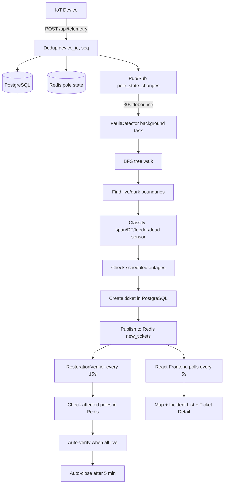

# System Architecture

## Data Flow Diagram

## Data Sourcing and Ingestion
Telemetry arrives via HTTP POST requests (`/api/telemetry` and `/api/telemetry/batch`). The ingestion layer employs a deduplication strategy utilizing `(device_id, sequence_number)` pairs backed by Redis to ignore duplicate packets. Stale messages are dropped by comparing timestamps to the most recent known state. The system is designed for burst tolerance by persisting raw events asynchronously where possible and using Redis for immediate state updates.

## Storage
- **PostgreSQL**: Stores the relational grid hierarchy (Substation → Feeder → DT → Pole tree). It also records raw `TelemetryEvent` logs and manages the `Ticket` lifecycle.
- **Redis**: Acts as an in-memory real-time state tracker for the current status of every pole, preventing heavy database reads. It also serves as the Pub/Sub broker for state changes.

## Network Topology Representation
The power grid is represented as a radial tree structure extending from Substation to Feeders to Distribution Transformers (DTs) and down to individual poles. 
- **Known Topology (40%)**: Utilizes a strict parent-child relationship via `parent_pole_id` foreign keys in the database.
- **Inferred Topology (60%)**: Employs a greedy nearest-neighbor geometric inference algorithm. It connects unmapped poles to the nearest known nodes while utilizing bearing-based branch detection to prevent crossing lines or illogical routing.

## The Localization Algorithm
The fault localization process operates independently of LLMs, ensuring deterministic and explainable results:
1. **Subscribe**: Listen to pole state changes via Redis Pub/Sub.
2. **Debounce**: Accumulate changes over a 30-second window per DT to account for telemetry jitter.
3. **Query**: Fetch all current pole states under the affected DT from Redis.
4. **BFS Walk**: Perform a Breadth-First Search from the DT root down the topology tree.
5. **Find Boundaries**: Identify frontier edges where the parent is LIVE but the child is DARK. Each frontier edge represents a fault on that specific span.
6. **Dead Sensor Check**: If a dark pole has live children, it is physically impossible for the pole to be unpowered. It's flagged as a sensor failure, not a grid fault.
7. **DT Fault**: If all poles under a DT are dark and there are no boundaries within the DT tree, the fault is at the DT level.
8. **Feeder Fault**: If all DTs on a feeder are dark, the fault is escalated to the feeder level.
9. **Group**: All dark poles downstream of a discovered boundary are grouped into a single incident.
10. **Confidence Scoring**: 0.9 for known topology, 0.6 for inferred topology, 0.85 for DT faults, and 0.95 for feeder faults.

**Complexity**: O(V+E) per DT, where V is the number of poles and E is the number of edges.

## Known Failure Cases
- 30% or more message loss during a massive outage can artificially create false live/dark boundaries, leading to incorrect span tickets instead of a single DT ticket.
- Missing devices on specific poles create uncertainty gaps where a fault could be anywhere between two reporting nodes.
- Geometric inference can miswire complex, dense urban branch patterns.

## Missing Topology Handling (60%)
For the 60% of the grid lacking explicit wiring data, a geometric inference approach is used. By walking nearest-neighbors and calculating angular bearings, the system simulates wiring. Failure modes include snapping to parallel but separate lines. The UI visually communicates this uncertainty by marking inferred lines with dotted patterns and displaying a lower confidence score (0.6).

## Noise Handling
- **Dead Sensors**: Filtered out when a parent is dark but children are live.
- **Scheduled Outages**: Cross-referenced with a ±40 minute buffer. If an outage occurs during a scheduled window, tickets are suppressed. Overdue outages are escalated to tickets.
- **Debouncing**: 30-second windows prevent flickering telemetry from spamming the ticketing system.

## API Surface
| Method | Path | Purpose |
|---|---|---|
| GET | `/api/topology/dts` | Retrieve list of Distribution Transformers |
| GET | `/api/topology/tree/{dt_id}` | Fetch the entire radial tree for a DT |
| POST | `/api/telemetry` | Ingest single IoT telemetry reading |
| POST | `/api/telemetry/batch` | Ingest bulk telemetry readings |
| GET | `/api/tickets` | Fetch active incident tickets |
| POST | `/api/tickets/{id}/acknowledge` | Acknowledge a ticket (Operator) |
| POST | `/api/tickets/{id}/assign` | Assign a crew to a ticket |
| POST | `/api/simulator/fault` | Inject a simulated grid fault |
| POST | `/api/simulator/repair` | Simulate telemetry restoration |

## UI Reasoning
The Operator Console uses a dark theme to reduce eye strain in 24/7 control rooms. The map takes center stage because spatial context is critical for dispatching crews. The incident list and ticket detail panels slide in to provide immediate context without losing the map view. Granular historical telemetry graphs are deliberately left off the main screen to avoid cognitive overload during crisis response.

## AI Feature
The system optionally includes an AI feature for generating natural language incident summaries (e.g., "Fault isolated to 200m span on MG Road, affecting 45 poles. Likely tree fall based on weather data."). 
- **Cost**: ~0.001 per incident.
- **Fallback**: If the LLM service is unavailable or times out, the system falls back to a deterministic template summary. LLMs are explicitly excluded from the critical path of fault localization to guarantee system reliability and speed.
